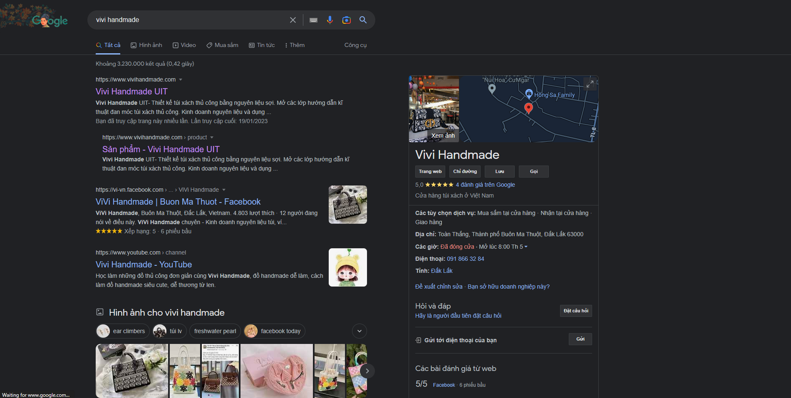
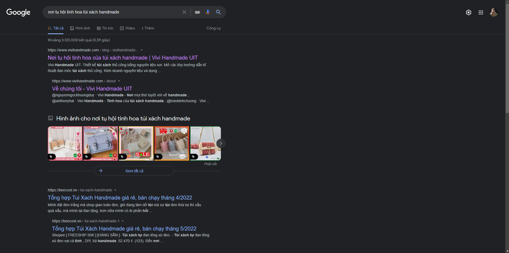

# [NEXTJS] Vivi Handmade - Website for handbags

## Introduction

Here is my javascript source code with my friend. A website is customized from Creative Tim Template and for SEO purposes.

    

## Motivation

My team has decided to implement this project because we want to know about SEO (Search Engine Optimization). To SEO successfully, I have use NextJS which is a framework that supports SSR and SSG. On the other hand, to increase performance for user experience, I have use some fonts from `fontsource.org` which is developed by Vercel, icons from `iconify.design`, reduce some unnecessary javascript, optimize image resolution, set metadata for website, etc...

## Results

I am happy to announce that our website has indexed by Google. It takes a lot of effort to make it to top 1 by searching on Google. You can see some results below

    
    <i>Vivi Handmade top 1 search</i>

    
    
    
    <i>Products on Google</i>

    
    
    
    <i>Blogs on Google</i>

## Installation

First time you see this repository, you must clone it and then run the following command:

### `npm install`

Moreover, you should have a backend which is running with ExpressJS and NodeJS. You should also have your database to run successfully.

After all the configuration, you can run the following command:

### `npm run dev`

And... That's all what you need.

## Requirements

- **nodejs >=14**

## Thank you

Thank you for the excellent contributions of my team to implement this project. I appreciate you if you have any questions and some comments for us to improve this project.

## Licensing

- Copyright 2021 <a href="https://www.creative-tim.com/?ref=nnjs-readme" target="_blank">Creative Tim</a>

- Licensed under <a href="https://github.com/creativetimofficial/notus-nextjs/blob/main/LICENSE.md" target="_blank">MIT</a>
